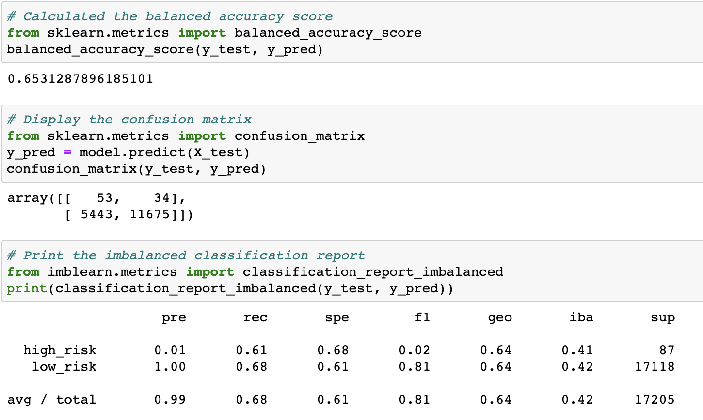
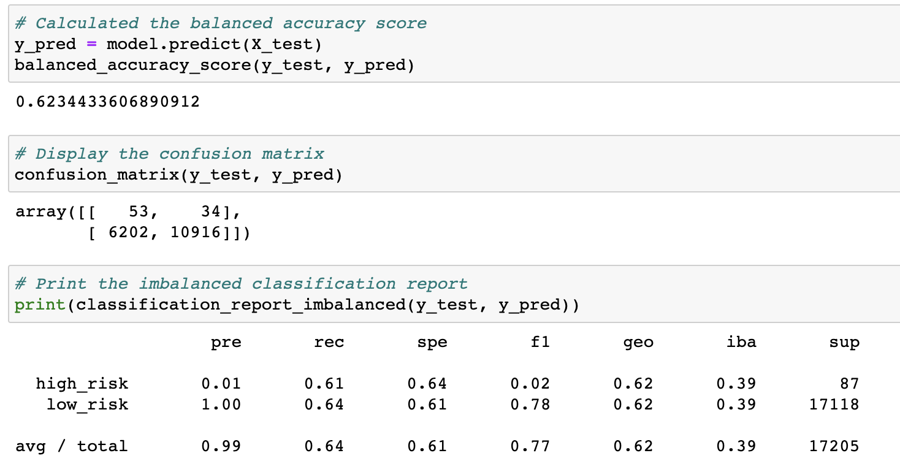
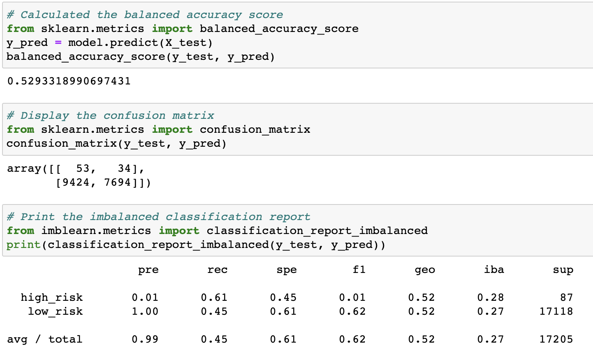
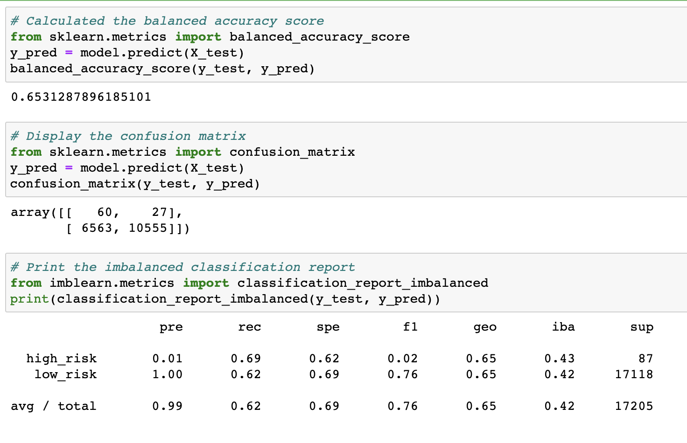
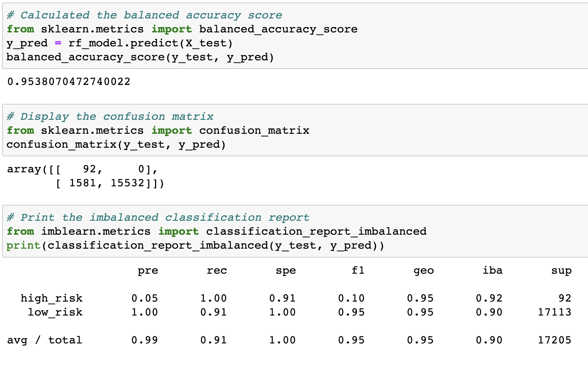
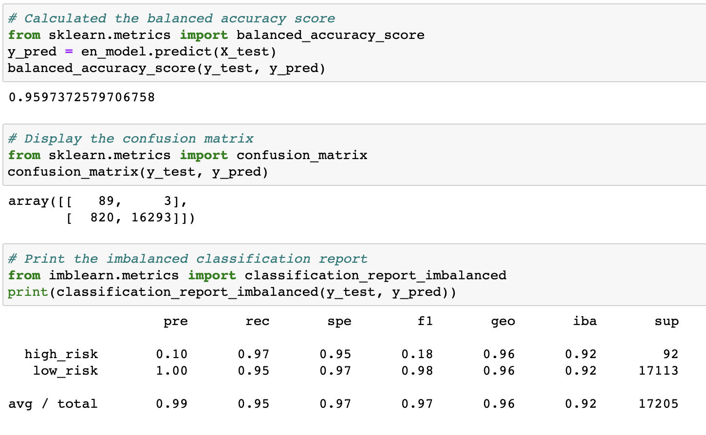

# Credit_Risk_Analysis
Module 18 - Credit Rist Analysis

## Overview of the loan prediction risk analysis:
- The purpose of the analysis is to identify credit risk using a credit card dataset. In order to test the detailed data, we first oversample using RandomOverSample and SMOTE. Then we undersample the data using the ClusterCentroids algorithm. Finally, we use a combination of both over and under sampling using the SMOTEENN algorithm. 
- Then we we use two difference machine learning techniques, reducing bias, to make predictions on credit card risk. First we use the BalancedRandomForestClassifier model and last we use the EasyEnsembleClassifier to compare the machine learning model's predictions of risk.

## Results:

- There is a bulleted list that describes the balanced accuracy score and the precision and recall scores of all six    machine learning models (15 pt)
  
1. RandomOverSample

  - The RandomOverSample balanced accuracy score and the precision and recall scores are as follows. 

2. SMOTE

  - The SMOTE balanced accuracy score and the precision and recall scores are as follows. 

3. ClusterCentroids

  - The ClusterCentroids balanced accuracy score and the precision and recall scores are as follows. 

4. SMOTEENN

  - The SMOTEENN balanced accuracy score and the precision and recall scores are as follows. 

5. BalancedRandomForestClassifier

  - The BalancedRandomForestClassifier balanced accuracy score and the precision and recall scores are as follows. 

6. EasyEnsembleClassifier

  - The EasyEnsembleClassifier balanced accuracy score and the precision and recall scores are as follows. 

## Summary:

- There is a summary of the results (2 pt)
- There is a recommendation on which model to use, or there is no recommendation with a justification (3 pt)

- As we can see the....
- I would recommend using the ... 

